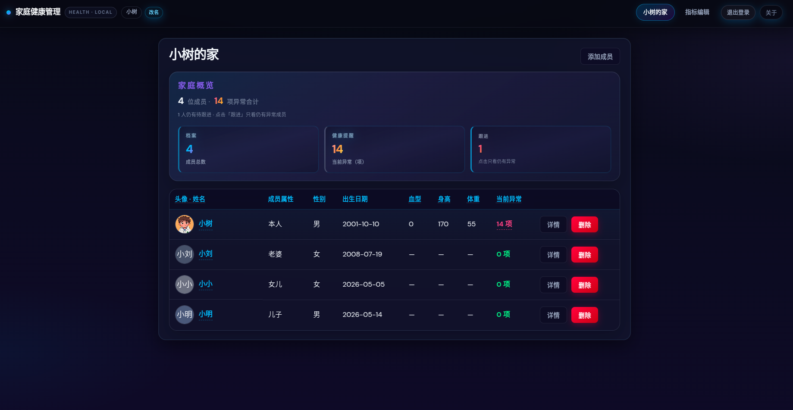
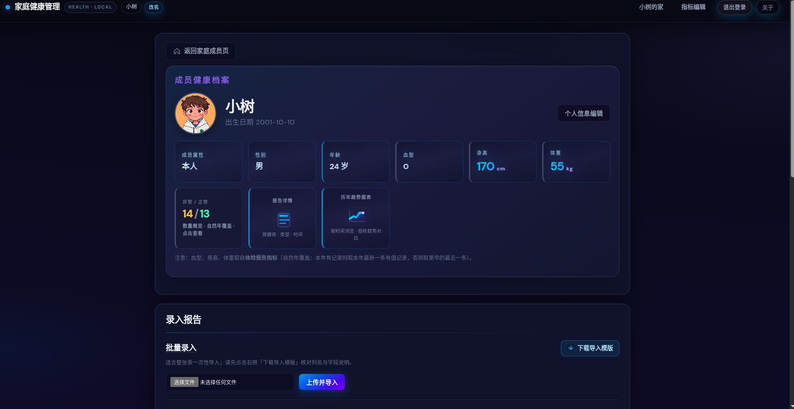
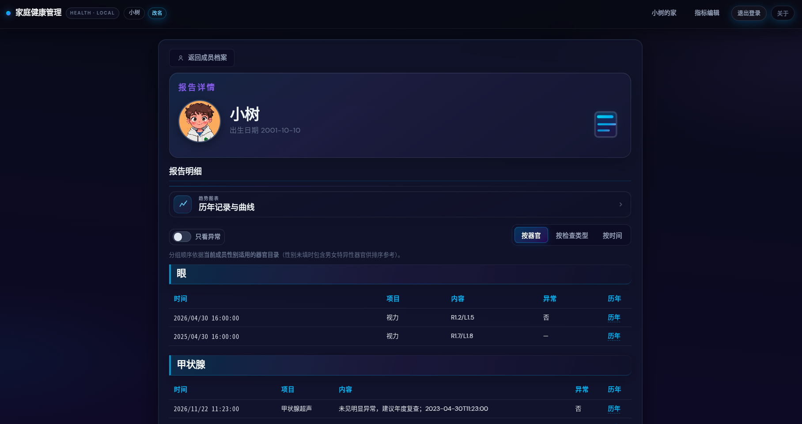
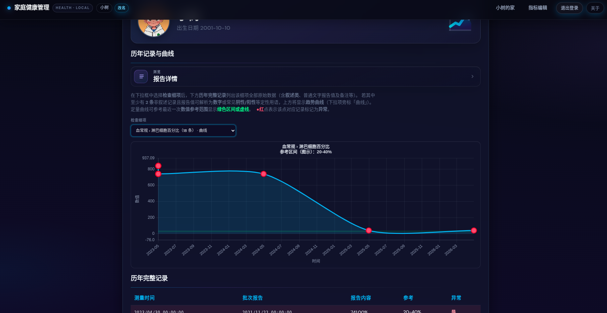

# Family Health Archive（家庭健康档案系统）

> **数据留在自家网络，服务全家健康管理**

体检与门诊化验报告常分散在纸质单据、各医院 App 和公司平台中，家庭成员若想**结构化留存、跨年对比趋势、照护老人全貌**，往往要反复翻找。  
本系统将数据存储在**服务端本地 SQLite**，通过浏览器在**家庭或可信任局域网**内访问，适合「数据不出自己家网络」的自我管理场景。

⚠️ **免责声明**：本软件不提供医疗诊断与建议，仅用于信息整理与个人备忘；请以医疗机构意见为准。

---

## 📑 目录

- [功能概览](#功能概览)
- [产品截图](#产品截图)
- [技术栈](#技术栈)
- [快速启动](#快速启动)
- [账号与口令](#账号与口令)
- [测试](#测试)
- [局域网部署](#局域网部署)
- [更多文档](#更多文档)

---

## 功能概览

| 模块       | 说明                                                  |
| ---------- | ----------------------------------------------------- |
| 会话与登录 | 单管理员会话（Cookie：`fh_session`）；业务 API 需登录 |
| 家庭成员   | 档案、血型/身高体重等可由报告回填、头像上传           |
| 报告批次   | 按一次体检批次归组；明细挂在批次下                    |
| 指标编辑   | 树形指标（分组 + 叶子细项）；器官库与自选器官         |
| 录入与明细 | 按人、按批次、按器官/类型/时间多视图                  |
| 趋势图     | Chart.js 时间序列与标注插件                           |
| 导入导出   | CSV 模板导出与批量导入；UTF-8（建议 BOM）             |

完整需求口径详见：  
👉 [docs/需求文档.md](./docs/需求文档.md)

---

## 产品截图

### 1. 首页



### 2. 个人健康档案页面



### 3. 用户档案详情页



### 4. 历年记录与曲线页面



---

## 技术栈

| 层级       | 技术                                                     |
| ---------- | -------------------------------------------------------- |
| 前端       | Vue 3.x · TypeScript · Vite 6.x · vue-router 4.x · axios |
| 图表       | Chart.js 4.x · date-fns · chartjs-plugin-annotation      |
| 后端       | FastAPI ≥0.115 · Starlette Session · uvicorn             |
| ORM / 校验 | SQLAlchemy 2.x · Pydantic v2                             |
| 安全       | bcrypt · itsdangerous                                    |
| 存储       | SQLite（默认 `backend/data/family_health.db`）           |

- **前端版本**：以 [`frontend/package.json`](./frontend/package.json) 中 `version` 为准（当前 `0.1.0`）
- **关于对话框版本**：与 [`frontend/src/components/AboutDialog.vue`](./frontend/src/components/AboutDialog.vue) 中 `APP_VERSION` 对齐（当前 `v1.0.0`）
- **Python**：建议 3.8+

---

## 快速启动

### ✅ 环境要求

| 组件    | 说明                                                    |
| ------- | ------------------------------------------------------- |
| Python  | 3.8+                                                    |
| Node.js | 建议当前 LTS（用于前端构建与开发）                      |
| 系统    | Linux / macOS 可直接使用一键脚本；Windows 建议使用 WSL2 |

---

### 1️⃣ 获取代码

```shell
git clone git@github.com:liu-XiaoShu/xiaoshuFamilyHealthArchive.git
cd xiaoshuFamilyHealthArchive
```


---

### 2️⃣ 安装依赖（首次执行）

**后端（推荐虚拟环境）**

```shell
cd backend
python3 -m venv .venv
./.venv/bin/pip install -r requirements.txt
cd ..

**前端**

bash
cd frontend
npm install
cd ..
```


---

### 3️⃣ 启动方式

#### ✅ 方式一：一键开发脚本（推荐）

在项目根目录执行：

```shell
chmod +x scripts/start-dev.sh
export PYTHON_BIN="$(pwd)/backend/.venv/bin/python"
./scripts/start-dev.sh
```

如需重置管理员口令：

```shell
./scripts/start-dev.sh --reset-admin-password
```

**访问地址**

| 服务         | 地址                                           |
| ------------ | ---------------------------------------------- |
| 前端         | http://127.0.0.1:5173                          |
| 后端健康检查 | http://127.0.0.1:8000/api/health               |
| API          | 开发模式下 `/api` 由 Vite 代理至后端 8000 端口 |

---

#### ✅ 方式二：手动双终端启动

**后端**

```shell
cd backend
./.venv/bin/uvicorn app.main:app --host 0.0.0.0 --port 8000
```

**前端**

```shell
cd frontend
npm run dev
```

浏览器访问：http://127.0.0.1:5173

---

### 4️⃣ 首次登录

当数据库为空时，将根据环境变量自动创建首个管理员：

| 环境变量            | 默认值                              |
| ------------------- | ----------------------------------- |
| `FH_ADMIN_USERNAME` | admin                               |
| `FH_ADMIN_PASSWORD` | family-health                       |
| `FH_SESSION_SECRET` | （内置占位，生产请自行设置 ≥16 位） |

建议在 `backend/.env` 中配置（参考 [`backend/app/settings.py`](./backend/app/settings.py)）。

---

## 账号与口令

### 修改用户名

登录后点击顶部用户名旁的 **「改名」**

### 修改登录口令

可使用开发脚本：

```shell
./scripts/start-dev.sh --reset-admin-password
```

⚠️ 生产环境操作前请备份 `family_health.db`

---

## 测试

### 后端会话与安全冒烟测试

```shell
cd backend
pip install -r requirements-dev.txt
./scripts/run-security-tests.sh -v
```

等价手动命令：

```shell

cd backend
PYTEST_DISABLE_PLUGIN_AUTOLOAD=1 PYTHONPATH=. \
python3 -m pytest tests/test_security.py -v
```


### 前端构建检查

```shell
cd frontend
npm run build
```


---

## 局域网部署

推荐 **前后端同源部署**，便于 Cookie 与文件上传（如 CSV）：

```shell
cd frontend && npm run build
cd ../backend
./.venv/bin/uvicorn app.main:app --host 0.0.0.0 --port 8000
```

局域网访问：

```shell
http://<服务器局域网IP>:8000

数据库文件位置：

backend/data/family_health.db
```


---

## 更多文档

- 📄 [需求规格说明（结构化归档）](./docs/需求文档.md)

---